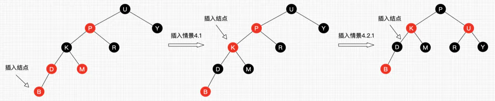

# Red Black Tree 红黑树

## 红黑树性质

* 节点颜色为红色或者黑色
* 根节点为黑色
* 每个叶子节点（nil）为黑色
* 每个红色节点的俩个子节点为黑色
* 每个节点到其叶子节点的路径包括相同数量的黑色节点

## 考虑红黑树插入的一个问题，怎么保证每个节点到其叶子节点的路径包括相同数量的黑色节点

[https://www.jianshu.com/p/e136ec79235c](https://www.jianshu.com/p/e136ec79235c)讲的不太好
[https://zh.wikipedia.org/wiki/%E7%BA%A2%E9%BB%91%E6%A0%91](https://zh.wikipedia.org/wiki/%E7%BA%A2%E9%BB%91%E6%A0%91)逻辑比较清楚

### 考虑点K
针对P来说，K需要做的是，不管K以下（包括点K）的节点颜色怎么变化，他都需要保证与R有相同数量的黑色节点（节点数计算时包括点K和R）， 所以当D和M变为黑色，K必须得变为红色才能保证P以下（不包括P）黑色节点数量不变（对应中间的图，黑色节点数平衡但是颜色不正确）；

这样不断向上迭代，最终黑色节点的增加只在根节点红色置为黑色；但是看叶子节点第一层第二层，好像也变成黑色了，但其实是二三层节点颜色的交换，从整体上看颜色并没有增加。

### 这里是从节点U考虑左旋右旋的
为什么不从点P，应该也可以保持

### 红黑树每次相当于向上移动两格，

### 红黑树删除的核心逻辑，
> 有红色节点才能保证旋转之后，根节点的包含的黑色节点数不变

* 使旋转过后删除节点有兄弟节点，不会因为删除造成树的不平衡
* 兄弟节点为红，可以通过旋转引入其他节点，使得删除节点不会少节点
* 兄弟节点为黑，如果过少了黑色节点，通过各种方法向兄弟节点子节点借节点（兄弟节点有红就可以），若兄弟节点为红色

## 性能 
对于每一次节点添加与删除，红黑树都会去检查当前树结构是否满足红黑树定的五条特性，如果不满足，红黑树最多会使用？次旋转（删除时）解决问题。
旋转使用不多，但是最坏情况也要一直向根迭代

最糟糕情况：替换结点的兄弟结点的子结点都为黑结点

## 删除逻辑
[https://zh.wikipedia.org/wiki/%E7%BA%A2%E9%BB%91%E6%A0%91](https://zh.wikipedia.org/wiki/%E7%BA%A2%E9%BB%91%E6%A0%91)
* 情况2：替代节点N，N的兄弟节点如果为红，进行旋转，结果N的父节点为红色
* 情况4基于情况2，父节点为红色，若节点N的兄弟节点的子节点全黑，通过交换父节点和兄弟节点，使得兄弟节点路径黑色节点数不变，节点N路径的黑色节点数加一，补充即将删掉的替代节点
* 另：情况4：节点N的父节点为红

* 情况5，6：（基于情况2的话是红色节点），父节点为红色（或黑），若节点N的兄弟节点的右节点红，左节点黑（若反过来可以通过旋转变成这样），通过左旋，并置原红色的兄弟节点的子节点为黑色，可以补充即将删掉的替代节点
* 另：情况5，6：节点N的父节点可以不为红

* 情况3：全为黑。思路是一层一层向上处理。通过转移替代节点（不好理解，或者说使父节点下的黑色节点数平衡，但相比原来都少了一个黑色节点），之后基于父节点向上继续做平衡处理，直到根节点

情况4，5，6父节点兄弟节点不能为红，否则不能补充

1. 先看兄弟节点是否为黑（保证可以补充替代节点），为红旋转得到兄弟节点为黑。为黑继续
2. 兄弟节点子节点全为黑->情况3;否则->情况5，6，增加替代节点侧的黑色节点数，且兄弟节点侧黑色节点数不变
* 兄弟节点为红旋转过后，得到的新的兄弟节点必定为黑，红黑树性质决定，因为红色节点后必接着黑色节点，然后继续第二步 