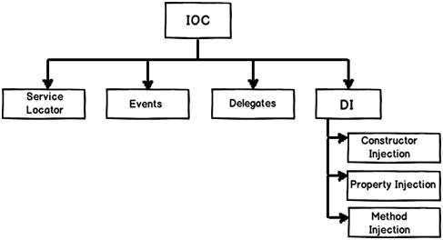
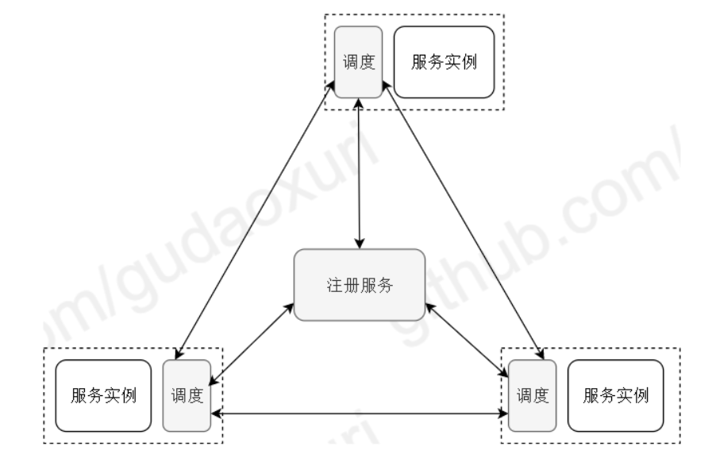

# Collection

## go slice

go中`slice`存放的是一个地址。s储存在栈区，s在栈中的地址是&s，存放的为数组`[1,2,3]`在堆区的地址s

	```
    var s = []int{1, 2, 3}
	fmt.Println("s存放的地址和s的地址")
	fmt.Printf("%p\n", s)
	fmt.Printf("%p\n", &s)
	a := s
	fmt.Println("a存放的地址和s的地址")
	fmt.Printf("%p\n", a)
	fmt.Printf("%p\n", &a)
    ```

# byte buffer and strings builder

[byte buffer vs strings builder](https://geektutu.com/post/hpg-string-concat.html)

如果我们自己来实现strings.Builder,
大部分情况下我们完成前3步就觉得大功告成了。但是标准库做得要更近一步。我们知道Golang的堆栈在大部分情况下是不需要开发者关注的，如果能够在栈上完成的工作逃逸到了堆上，性能就大打折扣了。因此，copyCheck
加入了一行比较hack的代码来避免buf逃逸到堆上。关于这部分内容，你可以进一步阅读Dave
Cheney的关于[Go’s hidden #pragmas](https://dave.cheney.net/2018/01/08/gos-hidden-pragmas).

# go结构体

```text
package main

import "fmt"

func main() {
	type test struct {
		id   int
		id2  int32
		name string // 16个字节
		id3  int
		id4  int8
	}
	//使用new(T)函数为一个结构体分配内存，返回该结构体的指针。
	var a = test{}
	//结构体放的顺序不同，内存消耗不同，为了能让CPU减少一次获取的时间，Go编译器会帮你把struct结构体做数据的对齐.cpu64位一次读8个字节，
	//https://www.jb51.net/article/265457.htm
	fmt.Printf("%p\n", &(a.id))   // int，8字节。
	fmt.Printf("%p\n", &(a.id2))  // int32，4字节。但是打印地址还是差8字节，因为内存对齐，浪费了内存空间。
	fmt.Printf("%p\n", &(a.name)) // string，16字节（地址八位，长度8位）。差八个字节，内存对齐，不是自己以为的地址8字节。这里是连续的，存的就是值。
	fmt.Printf("%p\n", &(a.id3))  // 差16个字节
	fmt.Printf("%p\n", &(a.id4))  // 差8个字节
	//fmt.Printf("%p\n", a)         // 结构体的地址和第一个字段的地址一样
	//fmt.Printf("%p", &a)
	//0xc00007e4b0
	//0xc00007e4b8
	//0xc00007e4c0
	//0xc00007e4d0
	//0xc00007e4d8

	/*这样实例化和 new一样，且能取到具体地址，只定义地址未初始化0x0*/
	//var b = &test{}
	//fmt.Printf("%p\n", &(b.id))
	//fmt.Printf("%p\n", &(b.id2))
	//fmt.Printf("%p\n", &(b.name)) //差八个字节。
	////fmt.Printf("%p\n", b)         // 结构体的地址和第一个字段的地址一样
	//fmt.Printf("%p", &b)

}
```

## json.unmarshal and json decoder

* 第一种 根据输入来定，如果是一个流，选用decoder，如果是一个字符串选用unmarshal
*

第二种说法：我建议不要使用json.Decoder。它用于JSON对象流，而不是单个对象。对于单个JSON对象，它的效率并不高，因为它将整个对象读入内存。它的缺点是，如果在对象后面包含了垃圾，它就不会报错。取决于几个因素，json。解码器可能无法完全读取正文，连接将不符合重用的条件。

> It really depends on what your input is. If you look at the implementation of the Decode method of json.Decoder, <mark>**it buffers the entire JSON value in memory before unmarshalling it into a Go value. So in most cases it won't be any more memory efficient**</mark> (although this could easily change in a future version of the language).
>
>So a better rule of thumb is this:
>
>Use json.Decoder if your data is coming from an io.Reader stream, or you need to decode multiple values from a stream of data. Use json.Unmarshal if you already have the JSON data in memory. For the case of reading from an HTTP request, I'd pick json.Decoder since you're obviously reading from a stream.
>
> <mark>高亮话指的是和unmarshal相比（从数据流读到内存，再unmarshal）相比，decoder将io.Reader(res.body)整个值又额外缓存了一次，先缓存到decoder里的io.reader中,再进行（从数据流读到内存，再unmarshal）/mark>

## golang结构体

[golang空结构体不占据内存空间](https://zhuanlan.zhihu.com/p/420542865)

[golang空结构体](https://docker.blog.csdn.net/article/details/106917358?spm=1001.2101.3001.6650.2&utm_medium=distribute.pc_relevant.none-task-blog-2%7Edefault%7ECTRLIST%7ERate-2-106917358-blog-117222307.pc_relevant_3mothn_strategy_recovery&depth_1-utm_source=distribute.pc_relevant.none-task-blog-2%7Edefault%7ECTRLIST%7ERate-2-106917358-blog-117222307.pc_relevant_3mothn_strategy_recovery&utm_relevant_index=3)

[WaitGroup优雅退出](https://blog.csdn.net/inthat/article/details/107000010?utm_medium=distribute.pc_relevant.none-task-blog-2~default~baidujs_baidulandingword~default-1-107000010-blog-124380196.pc_relevant_multi_platform_whitelistv3&spm=1001.2101.3001.4242.2&utm_relevant_index=4)

```go
package main

import (
	"fmt"
	"unsafe"
)

func main() {
	var i int
	var s struct{}
	{
	}
	fmt.Println(s)
	//fmt.Println(s == nil)
	fmt.Println(unsafe.Sizeof(s))
	fmt.Println(unsafe.Sizeof(i))
	fmt.Printf("%p\n", &s)
	fmt.Printf("%p", &i)
}
```

## 切片存的是什么

[切片存的是什么](https://blog.csdn.net/qq_24599471/article/details/106000190?ops_request_misc=&request_id=&biz_id=102&utm_term=golang%E5%88%87%E7%89%87%E5%AD%98%E7%9A%84%E4%BB%80%E4%B9%88&utm_medium=distribute.pc_search_result.none-task-blog-2~all~sobaiduweb~default-3-106000190.142^v67^control,201^v3^add_ask,213^v2^t3_control1&spm=1018.2226.3001.4187)

```go
package main

import (
	"fmt"
	"unsafe"
)

func main() {
	var a [8]int
	var b []int
	b = []int{1, 2, 3, 4, 4, 4, 4}
	fmt.Println(unsafe.Sizeof(a))
	fmt.Printf("%p\n", a)
	fmt.Println(unsafe.Sizeof(b))
	fmt.Printf("%p\n", b)
}
```

## nil

```go
package main

import "fmt"

func main() {
	var i int = 0
	var j int
	var name []int
	fmt.Printf("%v\n", i)
	fmt.Printf("%v\n", j)
	fmt.Printf("%p\n", &i)
	fmt.Printf("%p\n", &j)
	fmt.Printf("%p\n", name)
	fmt.Println(name == nil)
	fmt.Printf("%p\n", &name)
}
```

[nil](https://blog.csdn.net/zf766045962/article/details/81005037?ops_request_misc=%257B%2522request%255Fid%2522%253A%2522166980205016800213039738%2522%252C%2522scm%2522%253A%252220140713.130102334..%2522%257D&request_id=166980205016800213039738&biz_id=0&utm_medium=distribute.pc_search_result.none-task-blog-2~all~baidu_landing_v2~default-3-81005037-null-null.142^v67^control,201^v3^add_ask,213^v2^t3_control1&utm_term=golang%20nil&spm=1018.2226.3001.4187)

## go错误处理

如何解决嵌套错误 github.com/pkg/errors errors.wrap

## unsafe.pointer uintptr

- A pointer value of any type can be converted to a Pointer.
- A Pointer can be converted to a pointer value of any type.
- A uintptr can be converted to a Pointer.
- A Pointer can be converted to a uintptr 所以对指针操作需先转换为uintptr。

## string不用扩容，因为go里string对象不可以改变

## golang string rune byte

string实际上储存的是16位，八位地址八位长度

底层存的

- string len 结果是字节数，但是一个字符可能表达成1-3个字节
- rune 4个字节
- byte 1个字节

## 钩子函数

[钩子函数](https://blog.csdn.net/BF02jgtRS00XKtCx/article/details/110458293?spm=1001.2101.3001.6650.1&utm_medium=distribute.pc_relevant.none-task-blog-2%7Edefault%7ECTRLIST%7ERate-1-110458293-blog-89481066.pc_relevant_3mothn_strategy_recovery&depth_1-utm_source=distribute.pc_relevant.none-task-blog-2%7Edefault%7ECTRLIST%7ERate-1-110458293-blog-89481066.pc_relevant_3mothn_strategy_recovery&utm_relevant_index=2)

钩子函数和回调函数 个人理解就是见链接的python代码，没什么区别，可以自己控制在事件发生前后回调函数

## mask and sweep 和三色标记法

> golang GC的发展
> 由起初的标记->清除法到之后的三色标记法
> (原因：不想暂停业务逻辑过长时间影响程序运行，做法：采用强三色不变性和弱三色不变性保障GC过程不会错误回收仍在正常引用的对象)

### 强三色不变性和弱三色不变性

stw只是减少了，但是其实都有stw

#### 强三色不变性：不存在黑色引用白色，核心思想是在赋值器修改对象图（比如，向黑色的对象插入白色的对象时处理）

* 解决方法：插入写屏障，在向黑色对象插入新对象时，不允许黑色对象引用白色对象；在黑色对象引用新对象时，对其着色为灰色
    * 缺点： 需要二次stw处理栈
    * 额外处理：只对堆上的数据采用写屏障，不对栈空间对象处理；栈上发生写操作，将栈上的数据标记恒灰，扫描后进行stw处理，重新对栈扫描

#### 弱三色不变性：黑色对象引用的白色对象都处理灰色的保护下，核心思想是在赋值器修改对象图（比如，从白色或者灰色的对象删除白色节点时处理）

* 解决方法：删除写屏障，在从白色或者灰色对象删除对象时，对被删除的白色对象着色
    * 缺点：回收轻度低，堆上对象被删除，即使无指针指向该对象，在此轮GC仍可存活，在下轮GC处理
    * 额外处理：同样只对堆上数据生效，不对栈空间对象处理

注意，任意写屏障技术都不在栈上应用，因为要保证栈的运行效率。

[//]: # (插入写屏障”机制,对于栈中的对象是不生效的，“插入写屏障” 仅仅使用在堆中生效。所以在结束时需要STW来重新扫描栈，执行三色标记法回收白色垃圾)

插入和删除写屏障的取名依赖不同的关注点，函数类似，但是插入关注的是`ptr`，删除关注`slot`

```
// slot节点当前下游对象，ptr节点新添加的下游对象
// 灰色赋值器 Dijkstra 插入屏障
func DijkstraWritePointer(slot *unsafe.Pointer, ptr unsafe.Pointer) {
    shade(ptr)
    *slot = ptr
}
// 黑色赋值器 Yuasa 屏障
func YuasaWritePointer(slot *unsafe.Pointer, ptr unsafe.Pointer) {
    shade(*slot)
    *slot = ptr
}
// 混合写屏障
func HybridWritePointerSimple(slot *unsafe.Pointer, ptr unsafe.Pointer) {
	shade(*slot)
	shade(ptr)
	*slot = ptr
}
```

### 参考文献

[golang GC](https://www.cnblogs.com/flippedxyy/p/15558742.html)

<div id="refer-anchor-1"></div>

[1] [https://www.jianshu.com/p/4c5a303af470](https://www.jianshu.com/p/4c5a303af470)

<div id="refer-anchor-1"></div>

[2] [这里图片错误，Yuasa写屏障图片画错，正确应该是将删除的节点上色，图片画成了将指向删除节点的节点上色](https://golang.design/under-the-hood/zh-cn/part2runtime/ch08gc/barrier/)

个人感觉[[1]](#refer-anchor-1)比较准确，[[2]](#refer-anchor-2)很多内容值得商榷

## var, new and make

[var, new and make](./var,%20new%20and%20make.go)

## Golang 深浅拷贝

golang中所有拷贝均为值拷贝，出现类似引用拷贝是因为如slice底层是struct的原因。

* 注意golang中的copy()也不是深拷贝，copy()拷贝的是切片中的元素。对于多维切片来说，比如二维`a :=[][]int`，`copy(b,a)`拷贝的是a中的元素，及a中切片的地址。a和b地址不同，但是a[0]和b[0]
  地址相同。

[Golang 深浅拷贝](https://allendaydayup.blog.csdn.net/article/details/124913809?spm=1001.2101.3001.6661.1&utm_medium=distribute.pc_relevant_t0.none-task-blog-2%7Edefault%7ECTRLIST%7ERate-1-124913809-blog-127450453.pc_relevant_recovery_v2&depth_1-utm_source=distribute.pc_relevant_t0.none-task-blog-2%7Edefault%7ECTRLIST%7ERate-1-124913809-blog-127450453.pc_relevant_recovery_v2&utm_relevant_index=1)

## golang 遍历字符串(下标遍历，range遍历)

* 下标遍历得到的是`uint8`类型(对应`byte`类型)的数据，对`[]byte`,`string`，使用`len`获得的是字符串字节的长度
* 相对的，range遍历得到的是int32类型的数据(对应`rune`类型的数据)，对`[]rune`使用`len`获得的是获得的是字符的长度

## golang for

for循环条件，每次都重新计算循环条件

```
// for循环里面不固定每次重新计算len(string2)-len(string1)
string1 := "aa"
string2 := "aaaaaa"
for i := 0; i < len(string2)-len(string1); i++ {
	string1 = "0" + string1
}
fmt.Println(string1) //00aa
fmt.Println(string2) //aaaaaa
```

但是使用range 存在语法糖,如下代码不是死循环
`for_temp := range`和`len_temp := len(for_temp)`把长度和切片记录下来，所以：

1. 不会死循环
2. 打印`v[1]`为改动过后的值

```
func main() {
	v := []int{1, 2, 3}
	for _, data := range v {
		v = append(v, i) // 不是死循环
		v[1] = 100
		fmt.Println(data) // 打印的三个值为1，100，3
	}
}
```

## Goroutine栈空间无限大原因

[http://dave.cheney.net/2013/06/02/why-is-a-goroutines-stack-infinite](http://dave.cheney.net/2013/06/02/why-is-a-goroutines-stack-infinite)

[https://blog.csdn.net/weixin_52690231/article/details/124476954](https://blog.csdn.net/weixin_52690231/article/details/124476954)

[swap交换内存主要是指当物理内存不够用时，系统会启用硬盘的一部分空间来充当服务器内存，而默认情况下swap内存会有一些设置标准，它与物理内存的大小也是有关系的](https://blog.csdn.net/Listen2You/article/details/108205275?ops_request_misc=%257B%2522request%255Fid%2522%253A%2522167343982316800186555927%2522%252C%2522scm%2522%253A%252220140713.130102334.pc%255Fall.%2522%257D&request_id=167343982316800186555927&biz_id=0&utm_medium=distribute.pc_search_result.none-task-blog-2~all~first_rank_ecpm_v1~rank_v31_ecpm-2-108205275-null-null.142^v70^control,201^v4^add_ask&utm_term=%E5%A0%86%E5%86%85%E5%AD%98%E6%89%A9%E5%AE%B9%E5%90%97&spm=1018.2226.3001.4187)

这里好像还讲的是分段栈 when new stack pages are needed, they are allocated from the heap.

如果物理内存不足了，数据会在主存和磁盘之间频繁交换，命中率很低，性能出现急剧下降，我们称这种现象叫内存颠簸。这时你会发现系统的 swap 空间利用率开始增高， CPU 利用率中 iowait 占比开始增高。

## Golang 栈--分段栈和连续栈

[分段栈和连续栈](https://www.jianshu.com/p/7ec9acca6480)

Go 1.4 开始使用的是连续栈，而这之前使用的分段栈。 分段栈：分段栈是指开始时只有一个stack，当需要更多的 stack 时，就再去申请一个，然后将多个stack 之间用双向链接连接在一起。当使用完成后，再将无用的 stack
从链接中删除释放内存。 连续栈：创建一个两倍于原stack大小的新stack，并将旧栈拷贝到其中
> 与操作系统分段分页区分

* golang 连续栈指的是一整块连续的空间，反而有点类似操作系统的分段；
* golang 分段栈，指的是在运行时如果空间不足会创建新的栈空间，不同栈空间之间通过双向链表链接，反而有点类似分页；
*

操作系统分段，指的是虚拟内存对应一整段连续的物理内存区域，问题是粒度不够细，某个时间段内程序只有一小部分被访问，浪费了空间，换入换出磁盘造成大量io操作，且换出后空间的内存空间可能并不连续，即使总和空闲内存空间大于所需内存，程序仍无法装在进内存

* 操作系统分页，采用细粒度的方法，每个页占4kb空间，访问的页面不存在，就分配空间。页表基地址寄存器记录对应物理地址（空间不够，换入换出以页为单位，页面置换算法）

## 设计模式

单例模式，工厂模式

## 指针接收者

一个问题： 值类型可被寻址可以调用指针接收者的方法，编译器会做`(&fv).pointerMethod()`的操作. 那么问题来了，值类型不能寻址，比如函数返回值，其不能调用指针接收者方法，

当指针接收者实现接口时，值类型不可寻址自然不能实现接口。但是，为什么<font color=LightCoral>即使golang值类型可被寻址也不能实现指针类型的接口</font>，

```
h := man{} // grammatically correct
h.speak()
h.sing()
var j human = man{} // grammatical mistake

j.speak()
j.sing()

}

type human interface {
	speak()
	sing()
}

type man struct {
	name string
}

func (m man) speak() {
	fmt.Println("speaking")
}

func (m *man) sing() {
	fmt.Println("singing")
}
```

[指针接收者](https://stackoverflow.com/questions/38166925/why-cant-i-assign-types-value-to-an-interface-implementing-methods-with-receiv)

## How does GoLand of JetBrains find the implementations of interface?

`interface{}`是没有方法的接口所有所有类型都满足interface tab字段不仅被用来存储接口本身的信息(例如接口的类型信息、方法集信息等)，还被用来存储具体类型所实现的信息。tab字段是一个itab struct的指针。
itab这个struct的定义如下:

## Dependency Inversion Principle, Dependency Injection (DI), Inversion of Control (IoC)

[stackoverflow](https://stackoverflow.com/questions/6550700/inversion-of-control-vs-dependency-injection)

[https://www.zhihu.com/question/521822847](https://www.zhihu.com/question/521822847)

[https://www.zhihu.com/question/23277575](https://www.zhihu.com/question/23277575)

[https://www.jianshu.com/p/07af9dbbbc4b](https://www.jianshu.com/p/07af9dbbbc4b)


* Inversion of Control 思考java的ioc容器，对象的控制权上交ioc容器。原先A依赖B需要主动创建B,现在通过IOC容器将对象B注入对象A
* Dependency Injection (DI)  依赖注入(DI)模式是IoC模式的一个更具体的版本，实现通过constructors/setters/Interface ，对象将“依赖”这些以正确地行为。
* Dependency Inversion Principle 高级模块不应该依赖于低级模块。两者都应该依赖于抽象。抽象不应该依赖于细节。细节应该依赖于抽象。

这就是依赖倒置原则——把原本的高层建筑依赖底层建筑“倒置”过来，变成底层建筑依赖高层建筑。高层建筑决定需要什么，底层去实现这样的需求，但是高层并不用管底层是怎么实现的。这样就不会出现前面的“牵一发动全身”的情况。
控制反转（Inversion of Control） 就是依赖倒置原则的一种代码设计的思路。具体采用的方法就是所谓的依赖注入（Dependency Injection）。

## 逃逸分析

[https://cloud.tencent.com/developer/article/1861429](https://cloud.tencent.com/developer/article/1861429)
[https://www.51cto.com/article/744432.html](https://www.51cto.com/article/744432.html)
[https://juejin.cn/post/6898679464692187150](https://juejin.cn/post/6898679464692187150)
[http://npat-efault.github.io/programming/2016/10/10/escape-analysis-and-interfaces.html](http://npat-efault.github.io/programming/2016/10/10/escape-analysis-and-interfaces.html)
[https://forum.golangbridge.org/t/memory-allocation-difference-between-slice-and-array/18208](https://forum.golangbridge.org/t/memory-allocation-difference-between-slice-and-array/18208)
[https://juejin.cn/post/7155815911755087908](https://juejin.cn/post/7155815911755087908)
在编译原理中，分析指针动态范围的方法称之为逃逸分析。通俗来讲，当一个对象的指针被多个方法或线程引用时，我们称这个指针发生了逃逸。 Go语言的逃逸分析是编译器执行静态代码分析后，对内存管理进行的优化和简化，它可以决定一个变量是分配到堆还栈上。

1. 指针逃逸 指针逃逸应该是最容易理解的一种情况了，即在函数中创建了一个对象，返回了这个对象的指针。这种情况下，函数虽然退出了，但是因为指针的存在，对象的内存不能随着函数结束而回收，因此只能分配在堆上。
2. 栈空间不足
3. 接口传参，不能确定类型，（interface）逃逸

```go
package main

import "fmt"

var VP *int // a global pointer

func f(vp *int) {
	VP = vp
}

func g() {
	var v int // a local variable
	v = 40
	f(&v) // 内存逃逸，否则出现悬挂指针
	*VP = 42
	fmt.Println(v) // prints 42
}

func main() {
	g()
	fmt.Println(*VP) //prints 42
}
```

4. 变量占用内存较大
5. 编译期间不能确定变量大小

```go
package main

func test() {
	l := 1
	a := make([]int, l, l) // 编译期间不能确定l的值，会发生内存逃逸,array 10mb逃逸，切片64kb逃逸
	for i := 0; i < l; i++ {
		a[i] = i
	}
}

func main() {
	test()
}
```

```go
package main

func test() {
	//l := 1
	//a := make([]int, 1, 1)
	//for i := 0; i < l; i++ {
	//	a[i] = i
	//}

	//fmt.Println(a)
	//fmt.Println(len(a))
	//fmt.Println(cap(a))
	//fmt.Println(strings.Repeat("*",10))
	//fmt.Printf("%p\n",a)
	//fmt.Println(&a[0])
	//fmt.Printf("%p\n",&a)
	////fmt.Printf("%v\n", unsafe.Pointer(uintptr(unsafe.Pointer(&a))+8))
	//fmt.Printf("%x\n", *(*int)(unsafe.Pointer(uintptr(unsafe.Pointer(&a)))))
	//fmt.Printf("%v\n", *(*int)(unsafe.Pointer(uintptr(unsafe.Pointer(&a))+8)))
	//fmt.Printf("%v\n", *(*int)(unsafe.Pointer(uintptr(unsafe.Pointer(&a))+16)))
	//fmt.Printf("%v\n", unsafe.Pointer(uintptr(unsafe.Pointer(&a))+24))
	//fmt.Println(strings.Repeat("=",10))

	//fmt.Printf("%p\n", unsafe.Pointer(a)+16) // 错误，a不是指针，但是fmt.Printf("%p\n",a)输出做了处理
	//fmt.Printf("%p\n",uintptr(a))
	//
	//// 扩容 fmt 传参接口类型，使用fmt，内存逃逸,这样写代码没什么意义，看不到具体怎么分配的
	//a = append(a, 2)
	//fmt.Println(a)
	//fmt.Println(len(a))
	//fmt.Println(cap(a))
	//fmt.Println(strings.Repeat("*",10))
	//fmt.Printf("%p\n",a)
	//fmt.Println(&a[0])
	//fmt.Printf("%p\n",&a)
	////fmt.Printf("%v\n", unsafe.Pointer(uintptr(unsafe.Pointer(&a))+8))
	//fmt.Printf("%x\n", *(*int)(unsafe.Pointer(uintptr(unsafe.Pointer(&a)))))
	//fmt.Printf("%v\n", *(*int)(unsafe.Pointer(uintptr(unsafe.Pointer(&a))+8)))
	//fmt.Printf("%v\n", *(*int)(unsafe.Pointer(uintptr(unsafe.Pointer(&a))+16)))
	//fmt.Println(strings.Repeat("=",10))

	// 分配到堆和栈上
	a := make([]int, 1, 65536)
	b := make([]int, 1, 1)
	//b := make([]int, 1, l)
	a[0] = 1
	b[0] = 1
	//fmt.Printf("%p\n",&a[0])// 0xc000180000
	//fmt.Printf("%p\n",&b[0]) // 0xc00001a098
	//编译期间不能确定l的值，会发生内存逃逸,array 10mb逃逸，切片64kb逃逸

	//slice底层数组由于append操作超过了它的容量，它会重新分片内存。如果在编译时期知道切片的初始大小，则它会在栈上分配。
	//如果切片的底层存储必须被扩展，数据在运行时才获取到。则它将在堆上分配。
	//https://juejin.cn/post/6844903921568186376
}

func main() {
	test()
	//其次，栈是连续分配内存的，如果给一个数组或对象分配内存，栈会选择还没分配的最小的内存地址给数组，
	//在这个内存块中，数组中的元素从低地址到高地址依次分配（不要和栈的从高到低弄混了）。
	//所以数组中第一个元素的其实地址对应于已分配栈的最低地址。
}

```

6. golang闭包

## go 并发-锁与channel的选择

[go 并发-锁与channel的选择](https://lessisbetter.site/2019/01/14/golang-channel-and-mutex/)

channel底层牵扯到了锁

* channel的核心是关注的是数据的流动 传递数据的所有，即把某个数据发送给其他协程,分发任务，每个任务都是一个数据 交流异步结果，结果是一个数据
* mutex lock核心是关注公共的数据,mutex的能力是数据不动，某段时间只给一个协程访问数据的权限擅长数据位置固定的场景

```go
package main

import "time"
import "fmt"

func producer(nums ...int) <-chan int {
	out := make(chan int)
	go func() {
		defer close(out)
		time.Sleep(5 * time.Second)
		for _, n := range nums {
			time.Sleep(time.Second)
			out <- n
		}
	}()
	return out
}
func main() {
	ch := producer(1, 2, 3, 4, 5, 6, 7, 8, 910)
	for i2 := range ch {
		fmt.Println(i2)
	}
	a := <-ch
	fmt.Println(a)
}
```

[通信共享内存的含义：](https://medium.com/@buzoumei/%E4%B8%BA%E4%BB%80%E4%B9%88%E4%BD%BF%E7%94%A8%E9%80%9A%E4%BF%A1%E6%9D%A5%E5%85%B1%E4%BA%AB%E5%86%85%E5%AD%98-do-not-communicate-by-sharing-memory-instead-share-memory-by-communicating-5827bd3c4a77)
通信共享内存的含义： 不论通信模式，线程、协程最终都是从内存中获取数据，所以本质上都是通过共享内存来通信。

“通信共享内存”，应该说是使用发消息来同步信息，而不是多个线程或者协程直接共享内存。

发送消息是不同语言的高级抽象，实现这一机制时都会使用操作系统提供的锁机制来实现，共享内存也是使用锁这种并发机制实现的。

更为高级和抽象的信息传递方式其实也只是对低抽象级别接口的组合和封装。

Go的channel和Goroutine之间传递消息的方式内部实现时就广泛用到了共享内存和锁，通过对两者进行的组合提供了更高级别的同步机制。

[channel为nil的作用](https://medium.com/justforfunc/why-are-there-nil-channels-in-go-9877cc0b2308)
比如两个通道值合并，采取`select case`的方式赋给新通道。如果一个通道关闭，`select case`仍然可以取到关闭通道的类型的零值，如`chan int`
为0，若此时另一个通道阻塞，会浪费cpu资源。将关闭的通道赋予nil值，通道会阻塞，，就不会执行`case`后语句。

> 为什么nil通道会被阻塞

代码方面，

```
//在 src/runtime/chan.go中
func chansend(c *hchan, ep unsafe.Pointer, block bool, callerpc uintptr) bool {
 if c == nil {
      // 不能阻塞，直接返回 false，表示未发送成功
      if !block {
        return false
      }
      gopark(nil, nil, waitReasonChanSendNilChan, traceEvGoStop, 2)
      throw("unreachable")
 }
  // 省略其他逻辑
}
```

* channel缓冲区的大小不是类型声明的一部分
* 如果通道未被初始化，缓冲区大小将为0
* 缓冲区为0，通道无缓冲功能
* 通道无缓冲功能，发送将会被阻塞且等待接收
* 通道为nil，发送方和接收方无参考关系，他们都各自被阻塞

## go 并发问题(例如:string赋值不是原子操作)

某个类型能不能赋值,关键是看,赋值能不能由一条机器指令完成

[并发赋值检验](./tools/concurrency.go)

[并发赋值](https://cloud.tencent.com/developer/article/1810536)

## 左值和右值

左值：可以将左值看作是一个关联了名称的内存位置，允许程序的其他部分来访问它。
[左值和右值](https://www.zhihu.com/question/360636808)

[How are rvalues in c++ stored in memory?](https://stackoverflow.com/questions/34221287/how-are-rvalues-in-c-stored-in-memory)
[Where are rvalues stored in C++?](https://stackoverflow.com/questions/27841555/where-are-rvalues-stored-in-c)

## golang原子操作(cas)和mutex lock

[用户态到内核态的切换 in operatingSystem](../operatingSystem/operatingSystem.md#用户态到内核态的切换)

[实例](./tools/mutex%20and%20%20atomic.go)
优点：避免加互斥锁，可以提高程序的运行效率， 缺点：ABA 问题，值未发生变化但是值在期间被修改过（解决方法添加版本号）；一般处理单个变量；高并发时影响效率，CAS自旋占用CPU资源
[javaCAS](https://cloud.tencent.com/developer/article/1656853)

# 原子操作需要进入内核态吗

原子操作不一定需要进入内核态，它可以在用户态下实现。在用户态下，原子操作通常使用CPU提供的硬件指令来实现。这些指令可以保证在单个CPU周期内完成原子操作，从而实现线程安全。

在内核态下实现原子操作的主要原因是内核需要管理整个系统的资源，并且需要确保对这些资源的访问是原子的和线程安全的。在内核态下，原子操作通常使用CPU提供的特殊指令或者内核提供的特殊函数来实现。这些操作可以确保对内核资源的访问是原子的和线程安全的。

虽然原子操作可以在用户态下实现，但在某些情况下，例如需要操作内核资源或需要多个线程共享的全局变量，内核态下的原子操作可能更适合。但是，需要注意的是，进入内核态的开销相对较高，因此在实现原子操作时需要仔细考虑其性能和开销。

ABA问题两类：

- 1.由于内存重用（自动GC中不存在）导致的[比较并交换](https://zh.wikipedia.org/zh-cn/%E6%AF%94%E8%BE%83%E5%B9%B6%E4%BA%A4%E6%8D%A2)
-

2.整体出现的问题（比如链表，地址没变但是指向的节点变了（内容变了），原本期望修改的不是这个节点的内容），`比如栈，ABA问题有什么影响呢？简单的理解，假设我们在实现一个无锁的栈，当前栈项的内容是A。一个线程要往里面原子性插入C，它用CAS操作来保证这种原子性，想当然地认为，只要当前的栈还是A，并且CAS是原子性的，就能保证整个操作的原子性。可是万万没想到，这期间另一个线程，push了一个B，又push了一个A。栈的内容就不是前面那个线程想象的样子了。(实际结果->A->B->A->C,期望结果->A->C->B->A)`
,版本号解决

- 如果项目只在乎数值是否正确，那么ABA问题不会影响程序并发的正确性(golang里面是`atomic.CompareAndSwapInt32`)。

[这里的LOCK 称为 LOCK指令前缀，是用来设置CPU的 LOCK# 信号的。（译注：这个信号会使总线锁定，阻止其他处理器接管总线访问内存），直到使用LOCK前缀的指令执行结束，这会使这条指令的执行变为原子操作。在多处理器环境下，设置 LOCK# 信号能保证某个处理器对共享内存的独占使用。](https://blog.haohtml.com/archives/25881)

[lock前缀是一个特殊的信号，执行过程如下：对总线和缓存上锁。 强制所有lock信号之前的指令，都在此之前被执行，并同步相关缓存。 执行lock后的指令（如cmpxchg）。 释放对总线和缓存上的锁。 强制所有lock信号之后的指令，都在此之后被执行，并同步相关缓存。](https://www.cnblogs.com/sunddenly/articles/14829255.html)

[现在一般是采用“缓存锁定”的方案，避免降低内存的存取速度](https://dslztx.github.io/blog/2019/06/08/%E6%B1%87%E7%BC%96%E6%8C%87%E4%BB%A4%E7%9A%84LOCK%E6%8C%87%E4%BB%A4%E5%89%8D%E7%BC%80/)

在x86 平台上，CPU提供了在指令执行期间对总线加锁的手段。CPU芯片上有一条引线#HLOCK pin，如果汇编语言的程序中在一条指令前面加上前缀"LOCK"，经过汇编以后的机器代码就使CPU在执行这条指令的时候把#HLOCK
pin的电位拉低，持续到这条指令结束时放开，从而把总线锁住，这样同一总线上别的CPU就暂时不能通过总线访问内存了，保证了这条指令在多处理器环境中的原子性。 当然，并不是所有的指令前面都可以加lock前缀的，只有ADD, ADC, AND,
BTC, BTR, BTS, CMPXCHG,DEC, INC, NEG, NOT, OR, SBB, SUB, XOR, XADD, 和 XCHG指令前面可以加lock指令，实现原子操作。

## 原子操作不进入内核态 x86下

在进程A中通过系统调用sethostname(constchar *name,seze_t len)设置计算机在网络中的“主机名”.
在该情景中我们势必涉及到从用户空间向内核空间传递数据的问题，name是用户空间中的地址，它要通过系统调用设置到内核中的某个地址中。让我们看看这个过程中的一些细节问题：系统调用的具体实现是将系统调用的参数依次存入寄存器ebx,ecx,edx,esi,edi（最多5个参数，该情景有两个
name和len），接着将系统调用号存入寄存器eax，然后通过中断指令“int
80”使进程A进入系统空间。由于进程的CPU运行级别小于等于为系统调用设置的陷阱门的准入级别3，所以可以畅通无阻的进入系统空间去执行为int80设置的函数指针system_call()。由于system_call()
属于内核空间，其运行级别DPL为0，CPU要将堆栈切换到内核堆栈，即进程A的系统空间堆栈。我们知道内核为新建进程创建task_struct结构时，共分配了两个连续的页面，即8K的大小，并将底部约1k的大小用于
task_struct（如#definealloc_task_struct() ((struct task_struct *) __get_free_pages(GFP_KERNEL,1))
）,而其余部分内存用于系统空间的堆栈空间，即当从用户空间转入系统空间时，堆栈指针 esp变成了（alloc_task_struct()+8192），这也是为什么系统空间通常用宏定义current（参看其实现）获取当前进程的
task_struct地址的原因。每次在进程从用户空间进入系统空间之初，系统堆栈就已经被依次压入用户堆栈SS、用户堆栈指针ESP、EFLAGS、用户空间CS、EIP，接着system_call()
将eax压入，再接着调用SAVE_ALL依次压入ES、DS、EAX、EBP、EDI、ESI、 EDX、ECX、EBX，然后调用sys_call_table+4*%EAX，本情景为sys_sethostname()。

[深入理解Linux内核进程上下文切换（讲的很好！）](https://cloud.tencent.com/developer/article/1710837)

## Golang init顺序

[Golang init顺序](https://cloud.tencent.com/developer/article/2138066#:~:text=%E5%A6%82%E6%9E%9C%E5%8C%85%E5%AD%98%E5%9C%A8%E4%BE%9D%E8%B5%96%EF%BC%8C%E4%B8%8D%E5%90%8C,%E7%9A%84init%20%E5%87%BD%E6%95%B0%E5%AE%8C%E6%88%90%E5%88%9D%E5%A7%8B%E5%8C%96%E3%80%82)

## 微服务

> 微服务的注册与调度 一个应用拆分成多个服务，多个服务之间应该怎样联系。

1. 简单的方式就是使用nginx代理，问题是只能使用静态配置服务器实现负载均衡，对服务存活的感知和动态增删服务支持不完善，对企业总线压力大
2. 注册调度服务：各服务提供服务状态API，各服务器主动上报或者注册调度服务定时采集（注册中心可以由如zookeeper实现）
    * 中心化的注册与调度（类似nginx）；
    * 独立注册服务，采用中心注册服务，中心拥有最新路由表，各服务侧实现负载均衡（服务实例和调度未分开）
    * Service Mesh 将服务实例和调度分开，注册调度由组件实现
      
    * 每个服务机器上都部署一个 Proxy 模式的 etcd，这样就可以确保能访问 etcd 集群的服务都能互相连接。

> etcd

如果对读处理没有限制，有可能因为时间差导致follower状态落后，导致读不一致 可以通过`readindex`机制实现线性一致读 与zookeeper类似

1. 与传统数据库的区别

* 存储的一般是控制平台的数据
* MySQL 只保证最终一致性 eventual consistency（而且是不可配置的），因为它采用的是异步复制
* 通常不会是一些内容数据比如文本信息，更多的存储一些不经常更新状态的相对少量几个G左右的控制数据。

3. 与zookeeper区别：采用的一致性算法不同
   [Paxos算法与Zookeeper分析,zab (zk)raft协议(etcd) 8. 与Galera及MySQL Group replication的比较](https://www.cnblogs.com/williamjie/p/11137165.html)

4. 与redis的区别

* 都支持键值存储
* redis主从异步复制，数据丢失，不适合做注册和发现；etcd基于raft协议，不同节点数据一致，数据不丢
* redis与etcd相比没有watch
* redis 注册和发现如果采用redis的发布和订阅来做，网络出现问题收不到不会重复通知（不清楚）

> rpc(grpc)和http

不是一个层面的东西。http是一种通信协议格式，rpc是一种通讯方式。rpc可以采用诸如http协议或者自定义的tcp协议。rpc是面向于服务更高级的封装，包括服务发现，负载均衡熔断等。

* 使用http协议的优势是通用，主流的网页浏览支持http协议。http协议适用于大包通讯，对延迟要求不高，无需维持长连接。
*

自定义的二进制协议优势是低延迟，小包通讯，频率高，业务层长连接，如moba游戏。与自定义协议相比，http1.1协议编码效率低（报头采用文本编码，导致报文中有效字节少），不适用于后端进程之间的通信。所以，grpc采用了http2.0协议格式，优化了编码效率

## golang使用值传递还是指针

[golang使用值传递还是指针](https://hedzr.com/golang/pointer/go-pointer/)

## golang nil

nil是预定义的标识符，代表指针、通道、函数、接口、映射或切片的零值，也就是预定义好的一个变量：

```
type Type int
var nil Type
```

## golang内存分配

1. golang在程序启动的时候会向操作系统申请一大块内存，由go自己管理
2. golang申请到的内存会分为三个区域，span，bitmap和arena，arena由8kb大小的页组成，span中存放着页的地址，bitmap每个字节分为两部分，每部分4个bit，标识arena中的页是否有指针，是否被GC标记
3. golang基本的内存管理单元是mspan，go设置了多种不同大小，size的object，对应不同种类的mspan。mspan内部sizeclass决定了mspan分配页的个数
4. go有三个内存管理组件，mcache，mcentral和mheap
5. mcache存放着不同种类的mspan，根据需求给线程分配资源，如果没有会动态的向mcentral申请。这个在协程内部不存在竞争
6. mcentral多个协程共享，需要消耗锁，mcentral有多个对应不同大小的mspan，每个central中存放着已分配和未分配的mspan
7. 如果mcentral中的mspan被分配完，向mheap中申请，如内存消耗完会向操作系统申请新内存，mheap用于大对象内存的分配，mheap将内存分割为不同大小的object（mspan）
8. 极小对象会被tiny分配器分配到一个object中。比如classsize的前几个，被分配了一个页，object大小很小，一个mspan可分配多个object

## string 和[]byte互转

根据长度确定是否重新分配内存

```
// runtime/string.go go 1.15.7
const tmpStringBufSize = 32

type tmpBuf [tmpStringBufSize]byte

func stringtoslicebyte(buf *tmpBuf, s string) []byte {
 var b []byte
 if buf != nil && len(s) <= len(buf) {
  *buf = tmpBuf{}
  b = buf[:len(s)]
 } else {
  b = rawbyteslice(len(s))
 }
 copy(b, s)
 return b
}
// rawbyteslice allocates a new byte slice. The byte slice is not zeroed.
func rawbyteslice(size int) (b []byte) {
 cap := roundupsize(uintptr(size))
 p := mallocgc(cap, nil, false)
 if cap != uintptr(size) {
  memclrNoHeapPointers(add(p, uintptr(size)), cap-uintptr(size))
 }

 *(*slice)(unsafe.Pointer(&b)) = slice{p, size, int(cap)}
 return
}
```

## golang不可比较类型

* 不可比较类型slice，map，function

```
package main

import "fmt"

type A struct {
	name  string
	id    int
	slice []int
}

func main() {
	test1 := A{
		name:  "test",
		id:    1,
		slice: []int{1, 1},
	}
	test2 := A{
		name:  "test",
		id:    1,
		slice: []int{1, 1},
	}
	//fmt.Println(test1 == test2) //Invalid operation: test1 == test2 (the operator == is not defined on a)
	fmt.Println(test1)
	fmt.Println(test2)
}
```

### golang 中的四种类型转换总结

[https://learnku.com/articles/42797](https://learnku.com/articles/42797)

#### golang .(type)语法

```go
package main

func value(c Context, key any) any {
	for {
		switch ctx := c.(type) {
		case *valueCtx:
			if key == ctx.key {
				return ctx.val
			}
			c = ctx.Context
		case *cancelCtx:
			if key == &cancelCtxKey {
				return c
			}
			c = ctx.Context
		case *timerCtx:
			if key == &cancelCtxKey {
				return &ctx.cancelCtx
			}
			c = ctx.Context
		case *emptyCtx:
			return nil
		default:
			return c.Value(key)
		}
	}
}
```

#### 类型断言

#### unsafe类型强转

#### 显示类型转换

一个显式转换的表达式 T (x) ，其中 T 是一种类型并且 x 是可转换为类型的表达式 T，例如：uint(666)

在以下任何一种情况下，变量 x 都可以转换成 T 类型：

* x 可以分配成 T 类型。
* 忽略 struct 标签 x 的类型和 T 具有相同的基础类型。
* 忽略 struct 标记 x 的类型和 T 是未定义类型的指针类型，并且它们的指针基类型具有相同的基础类型。
* x 的类型和 T 都是整数或浮点类型。
* x 的类型和 T 都是复数类型。
* x 的类型是整数或 [] byte 或 [] rune，并且 T 是字符串类型。
* x 的类型是字符串，T 类型是 [] byte 或 [] rune。

```go
// * x 可以分配成 T 类型。
package main

import "fmt"

type Name interface {
	Da()
}

type A struct {
}

func (a A) Da() {
	fmt.Println("===========")
}

func main() {
	a := A{}
	_, ok := interface{}(a).(A)
	fmt.Println(ok)
}
```

#### 隐式类型转换

* 如函数传参

#### 编译器验证接口是否实现

var _ I = (*T)(nil) // Verify that *T implements I.

#### golang interface nil 判断

```go

var val *Temp

// taking a interface
var val2 interface{}

// val2 is a non-nil interface
// holding a nil pointer (val)
val2 = val

fmt.Printf("val2 is a nil interface: %v\n", val2 == nil)

fmt.Printf("val2 is a interface holding a nil"+
" pointer: %v\n", val2 == (*Temp)(nil))
fmt.Println(val2.(*Temp)==nil)
fmt.Println(val2==(*int)(nil))
```

#### 为什么map，assert，channel可以有不同的返回值个数

[https://stackoverflow.com/questions/36244725/why-map-and-type-assertion-can-return-1-or-2-values](https://stackoverflow.com/questions/36244725/why-map-and-type-assertion-can-return-1-or-2-values)

[https://stackoverflow.com/questions/28487036/return-map-like-ok-in-golang-on-normal-functions](https://stackoverflow.com/questions/28487036/return-map-like-ok-in-golang-on-normal-functions)

### golang切片append

底层原理，个人推测类似[https://go.dev/blog/slices-intro](https://go.dev/blog/slices-intro)中的`AppendByte`

```go
package main

var a []string
fmt.Println(len(a), cap(a))
b := make([]string, 0, 10)
// b:=make([]string,0)
fmt.Println(len(b))
fmt.Println(cap(b))
b = append(b, "111", "222")
c :=[]string{"333", "444"}
a = append(b, c...)
b[0] = "aaaaaaaaaaa"
fmt.Println(a)
fmt.Println(cap(a))
fmt.Println(len(b))
```

简而言之，像切片a通过`a = append(b,c...)`添加数据，如果切片b容量够用，则a和b共享地址； 若切片b容量不够用，则得到的是新切片的大小。

通过更改切片b的第一个元素，可以判断是否共享底层切片
