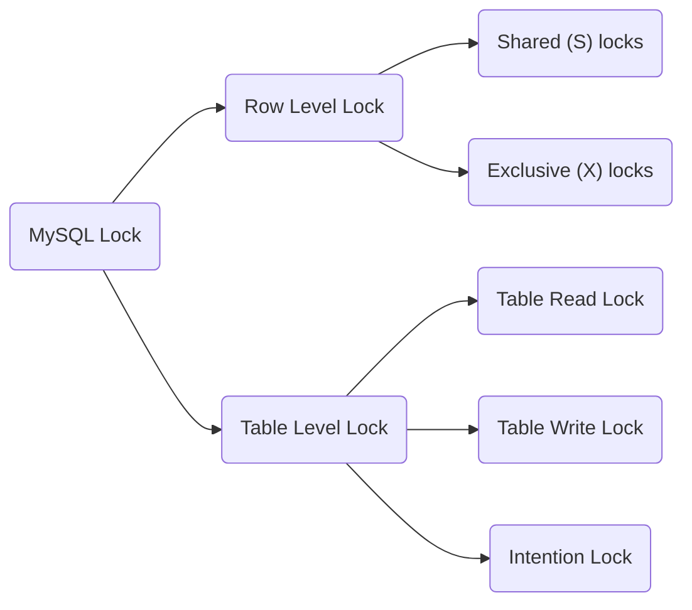

## 数据库建表外键约束

> 是否应将服务端校验尽可能嵌入到数据模型中？我的答案是：“否”。我知道这一次的回答更具争议。众所周知，数据库提供了一些数据一致性检查的功能，例如主键检查和外键检查。为什么不利用这些功能呢？ 我的经验告诉我，数据模型在诞生时并不完美，它们在生命周期内经常被调整。这就意味着数据模型中添加的业务逻辑越多，调整它们的成本将会越高。想象一下，您要调整一个外键所要付出的数据转换成本。而如果将这种校验逻辑与数据模型分开，则可以在调整模型时获得更大的灵活性。我并不是建议您完全不用它们，只是建议要三思

有人担心不设置外键约束会最终导致数据不一致，而我认为问题的本质是错误的数据模型设计。我就举一个回答中的例子：销售订单表和商品表设立了外键约束，即要求录入销售订单的时候，利用外键约束来检查商品是否存在。注意，这个外键的约束也仅仅是在录入订单的时候起到了检查作用，而在其他方面会添加麻烦。例如，我想归档某个商品（已经不生产了），
那我就必须要同时归档销售订单。而我又不想删除销售订单，因为我还想做一些销售历史分析。请问这时候该怎么办？

这里涉及的问题是两个实体，还是单个实体？有许多人把数据库的一个表说成是“实体”，这在业务建模中是错误的。实体是表之上的一种抽象，一种实体可以包含多个表的。以上面的例子，销售订单和商品是两个实体，这意味着一个实体的消亡不会影响另一个。这个时候你就不应该在销售订单上加商品的外键约束，商品对销售订单来说只是个属性。而如果是单个实体的情况，例如销售订单抬头表和行项目表，那么在行项目表上设置销售订单号的外键约束就合理了，因为行项目不能独立于抬头存在，要死一起死。基于以上模型设计的梳理，我相信也不存在分表分库的问题。因为无论如何不能将属于一个实体的表和属性分开的，它已经是一个原子了。

最后，如果利用了外键约束来防止添加或删除动作导致的数据不一致，应用开发是否能节省成本？回答是“NO”。因为数据库只会返回这样的错误文本“Foreign key constrain error!”。你好意思直接将这个文本抛给用户？

## 直接from多个表是笛卡尔连接

## 关于sql注入

```mysql
SELECT *
FROM golang_test
WHERE username = '\'ssssss\''
  AND password = '123456\'or 1=\'1';
```

```mysql
select '\'测\'试\'' as test;
```

在mysql里，单引号`'`和`\ `都可以作为转义字符。

实际防止sql注入的方法有两种，第一种采用预编译的方式`prepared statement (prepare + execute)`；第二种采用转义字符的方法。 以go源码为例，通过设置`interpolateParams`
实现预编译和转义特殊字符的切换。

[Mysql读写分离+防止sql注入攻击「GO源码剖析」](https://zhuanlan.zhihu.com/p/111682902)

[SQL预编译](https://www.jianshu.com/p/9972d7b33061)

[SQL注入](https://www.zhihu.com/question/335706717/answer/1778513564)
> InterpolateParams 设置为False，发生错误driver.ErrSkip，才会使用‘Prepared Statement‘方式再次执行查询；否则采用转义的方式

## 讲解数据库页和b+树记录检索

[讲解数据库页和b+树记录检索](https://blog.csdn.net/LXYDSF/article/details/125974218?spm=1001.2101.3001.6650.11&utm_medium=distribute.pc_relevant.none-task-blog-2%7Edefault%7EBlogCommendFromBaidu%7ERate-11-125974218-blog-122126352.pc_relevant_multi_platform_whitelistv4&depth_1-utm_source=distribute.pc_relevant.none-task-blog-2%7Edefault%7EBlogCommendFromBaidu%7ERate-11-125974218-blog-122126352.pc_relevant_multi_platform_whitelistv4&utm_relevant_index=16)

## 数据库锁

1. 行级锁 表级锁 自动意向锁



2. Shared and Exclusive Locks, Intention Locks,Record Locks, Gap Locks, Next-Key Locks, Insert Intention Locks, AUTO-INC
   Locks

> * 意向锁（Intention Lock）： <font color=LightCoral>（为了实现多粒度级别）</font> 在事务获得获得表中某行上的共享锁之前，必须先获得表上的IS锁或更强的锁；在事务获得表中某行上的排他锁之前，它必须首先获得表上的IX锁。（SELECT ... FOR UPDATE）
> * 行锁（Record Lock）：锁定单个行记录的锁，防止其他事务对此行进行update和delete。在RC、RR隔离级别下都支持。
> * 间隙锁（Gap Lock）：锁定索引记录间隙（不含该记录），确保索引记录间隙不变，防止其他事务在这个间隙进行insert，产生幻读。在RR隔离级别下都支持。
> * 临键锁（Next-Key Lock）：行锁和间隙锁组合，同时锁住数据，并锁住数据前面的间隙Gap。在RR隔离级别下支持。

3. 隐式加锁 和隔离级别相关，例如

> * InnoDB自动加意向锁。
> * 对于UPDATE、DELETE和INSERT语句，InnoDB会自动给涉及数据集加排他锁（X)；
> * 对于普通SELECT语句，InnoDB不会加任何锁；

4. InnoDB

> InnoDB 行锁是通过给索引上的索引项加锁来实现的，这一点 MySQL 与 Oracle 不同，后者是通过在数据块中对相应数据行加锁来实现的。InnoDB 这种行锁实现的特点意味着：只有通过索引条件检索数据，InnoDB 才使用行级锁，否则，InnoDB 将使用表锁。在不通过索引条件查询的时候，InnoDB 确实使用的是表锁，而不是行锁。

[数据库锁讲解](https://blog.csdn.net/zcl_love_wx/article/details/81983267)

[官方文档](https://dev.mysql.com/doc/refman/8.0/en/innodb-locking.html)

## 批量更新

* replace into
* insert into \<table> on duplicate key update
* temporary table update
* update \<table\> set \<updateField> case \<> when \<> then \<> end where \<> in ()

## SQL exists 原理

* exists做为where条件时,是先对where 前的主查询询进行查询,然后用主查询的结果一个一个的代入exists的查询进行判断，如果为真则输出当前这一条主查询的结果，否则不输出。
* 当子查询结果非常大时，EXISTS子句比IN快得多。相反，当子查询结果非常小时，IN子句比EXISTS快。 如果使用IN操作符，SQL引擎将扫描从内部查询中获取的所有记录。另一方面，如果我们使用EXISTS, SQL引擎将在找到匹配项后立即停止扫描过程。
* [exists和in性能比较](https://blog.csdn.net/a_hui_tai_lang/article/details/81146635?spm=1001.2101.3001.6650.5&utm_medium=distribute.pc_relevant.none-task-blog-2%7Edefault%7ECTRLIST%7ERate-5-81146635-blog-108504594.pc_relevant_3mothn_strategy_and_data_recovery&depth_1-utm_source=distribute.pc_relevant.none-task-blog-2%7Edefault%7ECTRLIST%7ERate-5-81146635-blog-108504594.pc_relevant_3mothn_strategy_and_data_recovery&utm_relevant_index=10)
* 
* 实际上优化器可能做了优化

## Mysql 小表驱动大表原因
因为小表驱动大表，遍历小表，利用了大表的索引，时间为`records(small) * log(records(big))`比`records(big) * log(records(small))`快.
驱动表索引没有生效，被驱动表索引有效

## 多表连接的三种方式
[多表连接的三种方式](https://www.sqlshack.com/internals-of-physical-join-operators-nested-loops-join-hash-match-join-merge-join-in-sql-server/)
* hash join 构建哈希表首先对构建表的连接键值进行哈希，并根据哈希值将它们放置到一个或另一个桶中。然后QP开始处理探测端，它对探测值应用相同的哈希函数，确定桶并比较桶内的值。如果匹配，则返回该行。 [https://www.sqlshack.com/hash-join-execution-internals/](https://www.sqlshack.com/hash-join-execution-internals/)
* merge join
* nested loop

## mysql varchar 255 vs 256
Last but not least, as @ypercube has reminded me, more than 1 byte for the length may be required even if you are using VARCHAR(255), because the definition is in characters, while the length stores bytes. For example REPEAT('ñ', 255) has more than 2^255 bytes in utf8, so it would require more than 1 byte for storing its length:
[https://dba.stackexchange.com/questions/76469/mysql-varchar-length-and-performance](https://dba.stackexchange.com/questions/76469/mysql-varchar-length-and-performance)

[https://www.jianshu.com/p/1a879c3c8c07](https://www.jianshu.com/p/1a879c3c8c07)

[https://stackoverflow.com/questions/15157227/mysql-varchar-index-length](https://stackoverflow.com/questions/15157227/mysql-varchar-index-length)

[https://stackoverflow.com/questions/29516162/how-does-mysql-varchar-know-how-many-bytes-indicate-the-length](https://stackoverflow.com/questions/29516162/how-does-mysql-varchar-know-how-many-bytes-indicate-the-length)