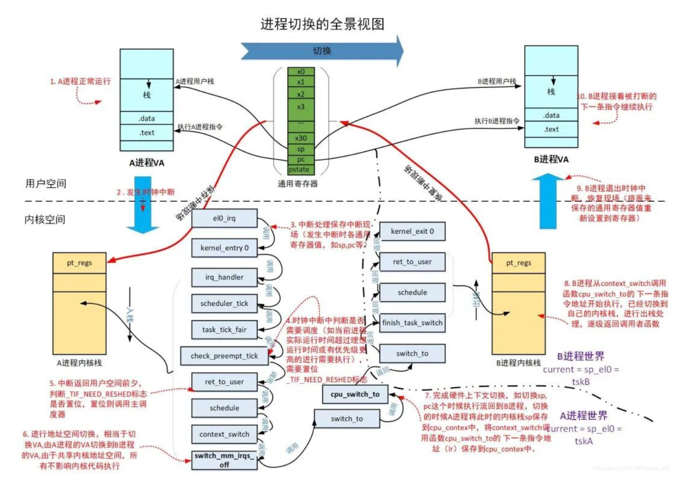
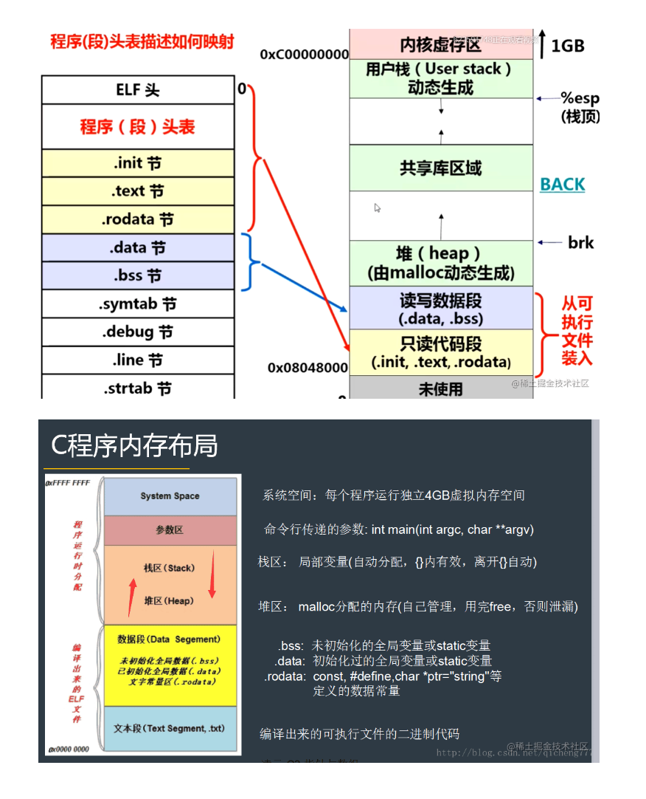
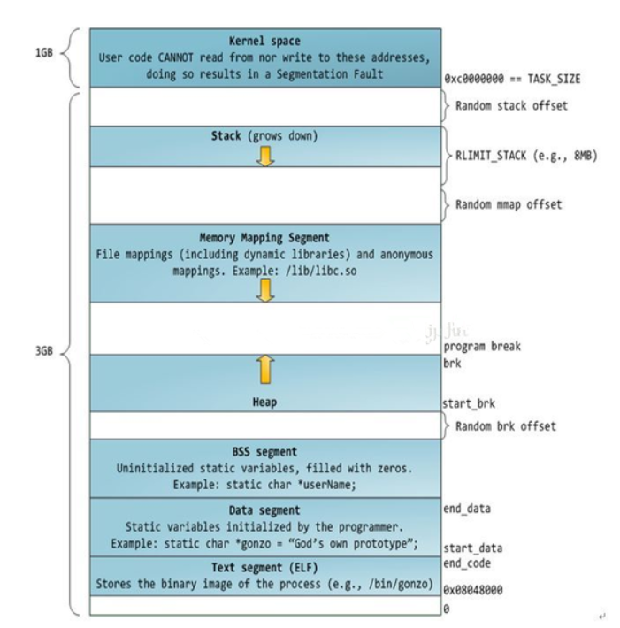

## 地址总线，数据总线

1. 计算机字长取决于计算机字长取决于哪种总线宽度?数据总线/地址总线?为什么？

   答1:取决于数据总线，宽度！代表一次可以取多少的数据！地址总线，相当于取数据的地址范围！ 可以这样比方，地址总线，相当于旅馆里的房号。 而数据总线，相当于一间房的大小！（不完全对，见下方）
2.

[例子](https://blog.csdn.net/weixin_39923623/article/details/119069555?utm_medium=distribute.pc_relevant.none-task-blog-2~default~baidujs_baidulandingword~default-4-119069555-blog-80732236.pc_relevant_recovery_v2&spm=1001.2101.3001.4242.3&utm_relevant_index=7)

3. 计算机的“字长”---俗称是多少位的CPU

   这里上下文特指计算机的字长，它就是CPU里寄存器的宽度，学了计算机组成应该知道，CPU里除了控制器、运算器之外，还有很多寄存器（当然现在CPU还有Cache等），机器的字长就是其中通用寄存器（GPR）的位宽。

   CPU在设计的时候会让运算器和通用寄存器的位宽保持一致，在硬件上就是CPU一次能进行的多少位数据运算，所以字长反应了CPU的数据运算能力（一次可以进行几位的数据运算，得到的结果是几位的）。
4.
    1. 32位和64位指的是cpu一次能处理的数据的长度（也就是寄存器的位数），源头的定义和数据总线和地址总线都没有关系2.
       如果数据总线的长度小于字长的话，那么会浪费cpu的处理能力，大于字长的话，传动过来的数据cpu一次处理不完，所以一般数据总线的长度等于字长3.
       指针也是数据，所以cpu一次处理的数据长度和指针长度最好是相等的，而指针的长度和地址总线又是对应的，所以地址总线的长度一般情况也会等于字长综上所述：字长==数据总线长度==地址总线长度（但是实际中地址总线很多高位用不到，所以默认置0，省去了一些地址总线，总的长度是小于64的，只是64位的机器理论上可寻址的范围在2的64次方B)
5. [总结1](https://www.bilibili.com/read/cv19325810)
   [总结2](https://blog.csdn.net/weixin_29440125/article/details/118988698)
   [题目](https://blog.csdn.net/jingjingshizhu/article/details/117289697?spm=1001.2101.3001.6650.1&utm_medium=distribute.pc_relevant.none-task-blog-2%7Edefault%7ECTRLIST%7ERate-1-117289697-blog-80732236.pc_relevant_recovery_v2&depth_1-utm_source=distribute.pc_relevant.none-task-blog-2%7Edefault%7ECTRLIST%7ERate-1-117289697-blog-80732236.pc_relevant_recovery_v2&utm_relevant_index=2)
6. 2.数据总线的宽度与字长及CPU位数

字长指CPU同一时间内可以处理的二进制数的位数，数据总线传输的数据或指令的位数要与字长一致。否则，如果数据总线宽度大于字长则一条数据或指令要分多次传输，则分开传输的几组数据也就没有意义了；如果数据总线宽度小于字长，则CPU的利用率要降低，对资源是种浪费。

另外，如果字长为n位，一般称CPU是n位的。所以说数据总线的宽度与字长及CPU的位数是一致的。

## 用户态到内核态的切换

[cas and lock in golang](../go/collection.md#golangcasmutex-lock)

当发生用户态到内核态的切换时，会发生如下过程（本质上是从“用户程序”切换到“内核程序”）

设置处理器至内核态。(模式位设置)
保存当前寄存器（栈指针、程序计数器、通用寄存器）。 将栈指针设置指向内核栈地址。 将程序计数器设置为一个事先约定的地址上，该地址上存放的是系统调用处理程序的起始地址。 而之后从内核态返回用户态时，又会进行类似的工作。

CAS基于硬件实现，不需要进入内核

CAS相当于在用户态代码里边插入了一个cmpxchg指令直观看大概是这个样子：用户态内存空间[...你的代码你的代码cmpxchg你的代码你的代码...]
这样CPU一直在用户态执行，执行到cmpxchg指令也不是说就是切换内核态了，切换到内核态可以这么理解：就是CPU开始执行了内核态内存空间的操作系统的代码。总结，CAS是没有发生用户态到内核态的切换的。只是在用户态执行了cmpxchg指令而已（<font color=LightCoral>
这个指令由硬件保证原子性，所谓不可再分的CPU同步原语</font>）。而执行指令要比上下文切换的开销要小，所以CAS要比重量级互斥锁性能要高。

---------------------------------------------------------------------------------------------------
然后说下重量级锁，直观看大概是这个样子：用户态空间[...你的代码你的代码你的代码lock] -> 执行操作系统内核态代码获得互斥锁（高低电位锁总线balabala）、返回互斥锁给用户态代码 ->
用户态空间[获得锁 你的代码你的代码...]这样上述过程很显然发生了用户态到内核态切换了。

> 从用户态到内核态切换可以通过三种方式，或者说会导致从用户态切换到内核态的操作：

1. 系统调用，这个上面已经讲解过了，在我公众号之前的文章也有讲解过。其实系统调用本身就是中断，但是软件中断，跟硬中断不同。 系统调用机制是使用了操作系统为用户特别开放的一个中断来实现，如 Linux 的 int 80h 中断。
2. 异常：如果当前进程运行在用户态，如果这个时候发生了异常事件，会触发由当前运行进程切换到处理此异常的内核相关进程中
3. 外围设备中断：外围设备完成用户请求的操作之后，会向CPU发出中断信号，这时CPU会转去处理对应的中断处理程序。

[为什么汇编语言不能越过操作系统操控硬件？](https://www.zhihu.com/question/43575404)

pgd（Page global directory）:页全局目录的虚拟地址 pcb（process control block）：进程控制块


> 为什么系统调用时要把一些寄存器保存到内核栈又从内核栈恢复？

1.CPU中有一些寄存器，它们的作用就像高级语言中的全局变量，在任何地方都可以读写，而且CPU在执行代码的时候一些寄存器会充当“临时变量”的作用，这也就导致了寄存器随时都会发生改变。系统调用本质上是调用一个函数，这个函数内部的实现细节不需要也不应该由调用方了解，那么调用方自然也不了解被调用的函数会不会修改寄存器。如果被调用的函数修改了寄存器，那么当函数返回后，调用方之前设置好的寄存器的值发生了改变，那么调用方的代码就可能出现BUG。为了解决这个问题，大家就约定由被调用的函数保存寄存器的值，并在函数即将返回时恢复这些寄存器的值，保证调用方的代码不会因为寄存器的值的改变而出错。<br>
举个例子，在执行函数调用的时候会在堆栈中保存下一条指令的地址（即返回地址）以保证函数调用完毕后能回到调用点继续执行之后的代码。恶意程序完全可以修改用户栈的内容，让被调用函数执行完毕后返回到自己的恶意代码中执行。因为用户栈的安全级别相对于内核栈是很低的。而如果使用内核栈来保存返回地址则要安全很多）

2.为什么要保存寄存器？因为函数调用就是要保存寄存器，这是ABI要求的，比如通常情况下ESI/EDI需要被调用者保护，所以系统调用如果用了寄存器，肯定是要保护的。如果题主问的是：为什么要保存所有寄存器？原因有两个：一个是为了安全，因为即使那些不需要保护的寄存器，在运行时的改动都可能包含内核的信息，这对于内核来说，并不够安全，用户层的代码可能会通过这些寄存器反推出一些内核的信息（入口地址等等）；另一个原因是历史习惯，因为早年的时候系统调用走的是软中断，软中断和硬中断某些入口代码是一致的，因为中断可能发生在代码的任何位置，所以必须要保存全部寄存器，所以系统调用的软中断也继承了这种方式。2.
为什么是内核栈？因为用户栈不可靠。操作系统的一个基本的设计原则就是尽量不要再内核里崩溃，那么这种情况下，如果用户栈即将溢出，那么用户代码产生一次系统调用，内核如果用用户栈保存数据（不切换SS）就会导致内核崩溃，而且用户也不清楚系统调用的栈开销，稳妥的方式是用内核栈（用户不可见，内核可见，内核可控）。那么如果在系统调用之前就用用户栈保存，这样就没有内核层面的栈溢出风险了，这样好不好？答案是不好，因为用户层的代码是不受内核保护的，这就给第三方程序恶意程序（甚至就是这个用户程序逐级）一个机会去修改调用栈，虽然崩溃的不会是内核，但用户层面会崩溃，风险也大。而且，确实有一些小众的操作系统这么干，但不算主流。况且万一内核就是希望访问某个寄存器，这个寄存器又恰好在用户栈，直接访问用户栈的风险太大。


[地址空间的切换](https://cloud.tencent.com/developer/article/1710837)
[这个讲的很好 mmu tlb 页表基地址寄存器](https://cloud.tencent.com/developer/article/1857523)
页表基地址寄存器内存放的是当前执行进程的页全局目录的物理地址，所以访问自己的一套页表，拿到的是属于自己的物理地址（实际上，进程是访问虚拟地址空间的指令数据的时候不断发生缺页异常，然后缺页异常处理程序为进程分配实际的物理页，然后将页帧号和页表属性填入自己的页表条目中），就不会访问其他进程的指令和数据，这也是为何多个进程可以访问相同的虚拟地址而不会出现差错的原因，而且做到的各个地址空间的隔离互不影响（共享内存除外）。

pgd虚拟地址转化为物理地址存放在ttbr0_el1中，这是用户空间的页表基址寄存器，当访问用户空间地址的时候mmu会通过这个寄存器来做遍历页表获得物理地址（ttbr1_el1是内核空间的页表基址寄存器，访问内核空间地址时使用，所有进程共享，不需要切换）。完成了这一步，也就完成了进程的地址空间切换，确切的说是进程的虚拟地址空间切换。

试想如果进程想要访问一个用户空间虚拟地址，cpu的mmu所做的工作，就是从页表基址寄存器拿到页全局目录的物理基地址，然后和虚拟地址配合来查查找页表，最终找到物理地址进行访问

> 进程控制块PCB （进程描述符），linux对应以下结构（截取）

```
struct task_struct {
    // 进程状态
    long              state;
    // 虚拟内存结构体
    struct mm_struct  *mm;
    // 进程号
    pid_t             pid;
    // 指向父进程的指针
    struct task_struct __rcu  *parent;
    // 子进程列表
    struct list_head        children;
    // 存放文件系统信息的指针
    struct fs_struct        *fs;
    // 一个数组，包含该进程打开的文件指针
    struct files_struct     *files;
};
```




bss：block start by symbol

[线程切换](https://www.zhihu.com/question/323415592)
[线程切换](https://zhuanlan.zhihu.com/p/352707156)

## 文件描述符表，文件表，innodes表（节点表）

## 操作系统-内存交换技术

> 内存交换

把所有进程一直保存在内存中需要巨大的内存，当然我们也不会这么做。那么我们是怎么做的呢？

最简单的策略是交换(swapping)技术，即把一个进程完整调入内存，使该进程运行一段时间，然后把它存回磁盘。空闲进程主要存储在磁盘上，所以当它们不运行时就不会占用内存(
尽管其中的一些进程会周期性地被唤醒以完成相关工作，然后就又进入睡眠状态)。另一种策略是虚拟内存，该策略甚至能使程序在只有一部分被调人内存的情况下运行。下面先讨论交换技术

## DMA 和零值拷贝

[https://mdnice.com/writing/2ec7a0b94ebb42fabb5ff12c4995e118](https://mdnice.com/writing/2ec7a0b94ebb42fabb5ff12c4995e118)

## 内核空间的系统调用函数mmap（不同于用户空间函数）

[https://zhuanlan.zhihu.com/p/553366240](https://zhuanlan.zhihu.com/p/553366240)
[https://juejin.cn/post/7124932618470031373](https://juejin.cn/post/7124932618470031373)

> mmap write，和sendfile，和上面连接讲的不一样，上述链接讲的是直接从磁盘拷贝进用户空间你，跳过了页缓存

* 用户态的mmap函数：通过虚拟地址将页缓存中的数据映射到进程的地址空间
* 内核态的mmap函数：被用于将设备地址空间与内核地址空间进行映射，从而允许内核直接访问硬件设备和驱动程序。

在使用mmap将文件映射到进程的虚拟地址空间时，虚拟地址确实会指向页缓存（page cache）。

当一个文件被映射到进程的虚拟地址空间时，内核会将文件的内容保存到页缓存中，然后通过虚拟地址将页缓存中的数据映射到进程的地址空间。这样，在进程对映射区域执行读写操作时，相应的缓存页面就可以被通过虚拟地址直接访问，而无需每次都进行磁盘I/O操作，从而提高了访问效率。

需要注意的是，为了确保数据的一致性，内核会定期将页缓存中的数据刷新回磁盘，并在必要时将文件的元数据同步到文件系统中。因此，在使用mmap时，我们需要注意文件同步和缓存刷新的相关问题，以免出现数据丢失或不一致的情况。
> mmap用户的虚拟地址指向页缓存对应的物理地址吗
>
>ChatAI:
> 是的，mmap映射的用户虚拟地址会指向页缓存对应的物理地址。
>
>当使用mmap将一个文件映射到进程的虚拟地址空间时，内核会在页缓存中将文件的数据和元数据载入内存，并建立虚拟地址和物理地址之间的映射关系。这样一来，在应用程序访问文件时，内核就可以直接从页缓存中获取数据，无需再进行磁盘I/O操作。
>
>当应用程序通过mmap修改文件时，内核会将修改的数据保存在页缓存中相应的页面上，并标记为“脏页”。内核会记录下这些脏页，定期或在特定事件触发的情况下，将它们写回磁盘上的文件系统中，从而保证数据的一致性和可靠性。
>
>总之，mmap与页缓存机制密切相关，它能够提高文件的访问效率和可靠性，是Linux系统中常用的文件操作方式之一。

## 深入理解Linux内核进程上下文切换

[https://cloud.tencent.com/developer/article/1710837](https://cloud.tencent.com/developer/article/1710837)

地址空间的切换（将即将执行的进程的页全局目录的物理地址设置到页表基址寄存器，以及tlb的清除）和硬件上下文的切换（寄存器和程序计数器中保存的-处理器状态切换就是将前一个进程的sp,pc等寄存器的值保存到一块内存上，然后将即将执行的进程的sp,pc等寄存器的值从另一块内存中恢复到相应寄存器中，）

